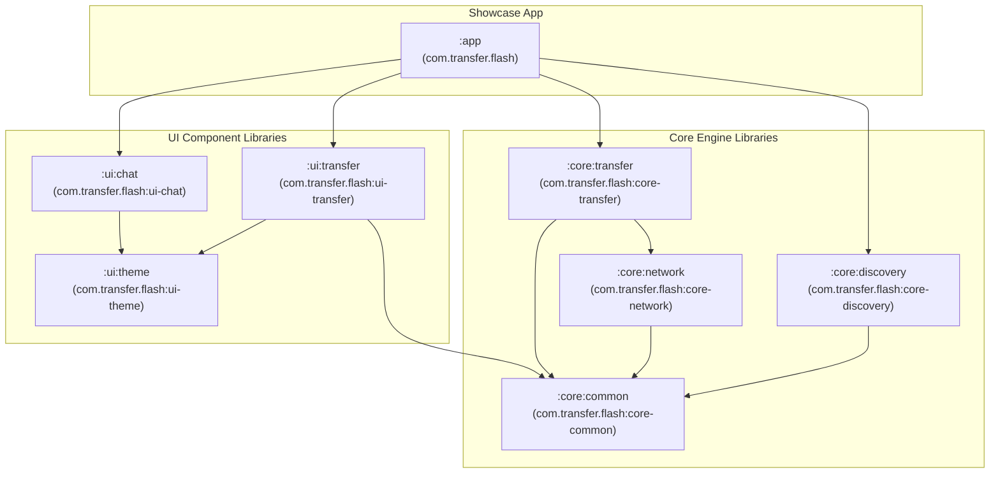

# Flash Modular Multi-Library Architecture & Publishing Plan

**Status:** APPROVED (ADR-008)  
**Target Group ID:** `com.transfer.flash`  
**Detailed Audit & Implementation Plan:** [`docs/architecture/library-first-migration-plan.md`](architecture/library-first-migration-plan.md)  
**Public API Specification:** [`docs/architecture/public-api.md`](architecture/public-api.md)  
**Goal:** Modularize Flash into independent, reusable, and hostable Android/Kotlin libraries so that third-party developers can consume core networking/transfer engines and custom UI components individually or together.

---

## 1. Architectural Overview & Objectives

### Core Objectives
1. **Headless Usability:** Core networking, discovery, and file transfer engines (`:core:*`) have **zero Compose or UI dependencies**. They can run in background services, foreground services, workers, or CLI tools.
2. **Backend-Agnostic UI:** UI components (`:ui:chat`, `:ui:transfer`) are driven by abstract repository interfaces (`FlashChatRepository`, `TransferSession`), allowing developers to use Flash's custom UI with any custom backend (LAN, Wi-Fi Direct, WebSockets, Bluetooth, or Cloud).
3. **Standalone Publishability:** Every library module can be built, tested, packaged as an AAR/JAR, and published to Maven Central, JitPack, or GitHub Packages with its own POM metadata, documentation, and sources.
4. **Compile-Time Layer Isolation:** Strict Gradle module boundaries prevent accidental coupling between UI layers and low-level socket connections.

---

## 2. Module Topology & Dependency Graph



---

## 3. Module Registry & Responsibilities

| Module | Target Artifact | Package Namespace | Primary Contents & Responsibilities |
|---|---|---|---|
| **`:core:common`** | `com.transfer.flash:core-common` | `com.transfer.flash.core.common` | • `AppIdentity` (device ID, friendly name storage)<br/>• `DiscoveredDevice`, `PeerPresence`, `TransportType`<br/>• Shared protocol serializers / escape helpers<br/>• Result monads & common annotations (`@FlashInternalApi`, `@FlashExperimentalApi`) |
| **`:core:discovery`** | `com.transfer.flash:core-discovery` | `com.transfer.flash.core.discovery` | • **Auto Discovery:** Android NSD (mDNS) advertisement, discovery, and query resolver queue<br/>• **Manual Discovery:** Direct IP & port endpoint reachability probe<br/>• **Wi-Fi Direct Discovery:** P2P peer scanning abstraction (future)<br/>• Discovery state flows and lifecycle bindings |
| **`:core:network`** | `com.transfer.flash:core-network` | `com.transfer.flash.core.network` | • Persistent socket session management (`LanSession`)<br/>• Zero-dependency RFC 6455 WebSocket client, server, and codec (`WebSocketCodec`, `WsConnection`)<br/>• Multi-peer connection mesh registry & connection arbitration<br/>• Network interface & socket factory binding (`LocalNetworkAddresses`) |
| **`:core:transfer`** | `com.transfer.flash:core-transfer` | `com.transfer.flash.core.transfer` | • **Sending Engine:** SAF (Storage Access Framework) streaming, binary chunking, concurrency control<br/>• **Receiving Engine:** Chunk reassembly, byte-count verification, checksums (SHA-256 / BLAKE3), file write pipeline<br/>• Pause, resume, cancellation, and retry state machines<br/>• StateFlow progress observables (`TransferProgress`, speed, ETA) |
| **`:ui:theme`** | `com.transfer.flash:ui-theme` | `com.transfer.flash.ui.theme` | • **Design System:** `FlashTheme`, `FlashColors`, `FlashTypography`, `FlashShapes`, `FlashSpacing`, `FlashDimensions`, `FlashElevation`<br/>• **Motion Design:** `FlashMotion` tokens, springs, transition specs<br/>• **Custom Icons:** `FlashIcons` registry + all vector drawables (`res/drawable/flash_ic_*`)<br/>• **Atomic UI Primitives:** `FlashAvatar`, `FlashSurface`, `FlashButton`, `FlashIconButton` |
| **`:ui:chat`** | `com.transfer.flash:ui-chat` | `com.transfer.flash.ui.chat` | • `FlashChatListScreen` & custom inbox rows (swipe, unread badges)<br/>• `FlashChatHeader` with live presence and transport indicator<br/>• `FlashMessageBubble` (custom concave-tail geometry, grouped rhythm)<br/>• `FlashMessageList` (insertion animation, reverse-layout glide)<br/>• `FlashComposer` & `FlashSendButton` (adaptive multiline, IME insets)<br/>• Abstract `FlashChatRepository` contracts |
| **`:ui:transfer`** | `com.transfer.flash:ui-transfer` | `com.transfer.flash.ui.transfer` | • Discovered peer picker sheet & nearby devices list<br/>• Active transfer progress cards and bottom sheets<br/>• Manual IP/Port connection dialogs<br/>• `WsTransferScreen` diagnostic / standalone transfer interface |
| **`:app`** | *(Application APK)* | `com.transfer.flash` | • Runnable showcase and verification app<br/>• Aggregates all library modules into a cohesive user experience<br/>• `MainActivity` navigation coordinating Chat, Transfer, and Diagnostics |

---

## 4. Package Structure & Source File Mapping

```text
Flash/
├── core/
│   ├── common/
│   │   └── src/main/java/com/transfer/flash/core/common/
│   │       ├── identity/AppIdentity.kt
│   │       ├── model/DiscoveredDevice.kt
│   │       ├── model/TransportType.kt
│   │       ├── protocol/ProtocolConstants.kt
│   │       └── annotations/FlashAnnotations.kt
│   ├── discovery/
│   │   └── src/main/java/com/transfer/flash/core/discovery/
│   │       ├── nsd/LanDiscovery.kt
│   │       └── manual/LanManualProbe.kt
│   ├── network/
│   │   └── src/main/java/com/transfer/flash/core/network/
│   │       ├── tcp/LanSession.kt
│   │       ├── tcp/LanProbeServer.kt
│   │       ├── tcp/LanConnectionProbe.kt
│   │       ├── tcp/LocalNetworkAddresses.kt
│   │       ├── ws/WebSocketCodec.kt
│   │       ├── ws/WsConnection.kt
│   │       ├── ws/WsTransferServer.kt
│   │       ├── ws/WsTransferClient.kt
│   │       └── ws/WsPairingStore.kt
│   └── transfer/
│       └── src/main/java/com/transfer/flash/core/transfer/
│           ├── engine/WsTransferManager.kt
│           ├── model/TransferProgress.kt
│           └── io/SafStreamWriter.kt
├── ui/
│   ├── theme/
│   │   ├── src/main/java/com/transfer/flash/ui/theme/
│   │   │   ├── FlashTheme.kt
│   │   │   ├── FlashColors.kt
│   │   │   ├── FlashTypography.kt
│   │   │   ├── FlashShapes.kt
│   │   │   ├── FlashSpacing.kt
│   │   │   ├── FlashDimensions.kt
│   │   │   ├── FlashElevation.kt
│   │   │   └── FlashMotion.kt
│   │   ├── src/main/java/com/transfer/flash/ui/icons/
│   │   │   └── FlashIcons.kt
│   │   ├── src/main/java/com/transfer/flash/ui/components/
│   │   │   └── FlashAvatar.kt
│   │   └── src/main/res/drawable/
│   │       └── flash_ic_*.xml
│   ├── chat/
│   │   └── src/main/java/com/transfer/flash/ui/chat/
│   │       ├── FlashChatListScreen.kt
│   │       ├── FlashChatListRow.kt
│   │       ├── FlashChatListTopBar.kt
│   │       ├── FlashChatListModels.kt
│   │       ├── FlashChatHeader.kt
│   │       ├── FlashMessageBubble.kt
│   │       ├── FlashMessageList.kt
│   │       ├── FlashComposer.kt
│   │       ├── FlashConversationScreen.kt
│   │       ├── FlashConversationModels.kt
│   │       ├── FlashMessageActionsSheet.kt
│   │       ├── FlashReactionsRow.kt
│   │       └── FlashChatRepository.kt
│   └── transfer/
│       └── src/main/java/com/transfer/flash/ui/transfer/
│           └── WsTransferScreen.kt
└── app/
    └── src/main/java/com/transfer/flash/
        └── MainActivity.kt
```

---

## 5. Gradle Build & Publishing Configuration

### A. Root `settings.gradle.kts`
```kotlin
rootProject.name = "Flash"

include(":app")
include(":core:common")
include(":core:discovery")
include(":core:network")
include(":core:transfer")
include(":ui:theme")
include(":ui:chat")
include(":ui:transfer")
```

### B. Version Catalog (`gradle/libs.versions.toml`)
```toml
[plugins]
android-application = { id = "com.android.application", version.ref = "agp" }
android-library = { id = "com.android.library", version.ref = "agp" }
kotlin-compose = { id = "org.jetbrains.kotlin.plugin.compose", version.ref = "kotlin" }
```

### C. Standard Library Publishing Script Template
Each library module applies `maven-publish` and configures the standard POM metadata:
```kotlin
plugins {
    alias(libs.plugins.android.library)
    `maven-publish`
}

android {
    namespace = "com.transfer.flash.<module>"
    compileSdk { version = release(37) }
    defaultConfig {
        minSdk = 24
        consumerProguardFiles("consumer-rules.pro")
    }
    publishing {
        singleVariant("release") {
            withSourcesJar()
            withJavadocJar()
        }
    }
}

publishing {
    publications {
        register<MavenPublication>("release") {
            groupId = "com.transfer.flash"
            artifactId = "<artifact-name>"
            version = "1.0.0"

            afterEvaluate {
                from(components["release"])
            }

            pom {
                name.set("Flash <Module Name>")
                description.set("Decoupled component of the Flash P2P transfer and messaging suite.")
                url.set("https://github.com/your-org/flash")
                licenses {
                    license {
                        name.set("Apache-2.0")
                        url.set("https://www.apache.org/licenses/LICENSE-2.0.txt")
                    }
                }
            }
        }
    }
}
```

---

## 6. Step-by-Step Implementation Roadmap

```text
Step 1: Build Infrastructure
  - Add android-library plugin alias in libs.versions.toml
  - Update root build.gradle.kts to register android-library plugin
  - Update settings.gradle.kts with the multi-module project includes

Step 2: Core Modules Extraction
  - Create core/common (AppIdentity, DiscoveredDevice, models, protocols, annotations)
  - Create core/discovery (LanDiscovery, NSD queuing, manual probe)
  - Create core/network (LanSession, WebSocketCodec, WsConnection, WsTransferServer, WsTransferClient)
  - Create core/transfer (WsTransferManager, transfer progress models, SAF streaming)
  - Migrate corresponding unit tests (WebSocketCodecTest, WsTransferMessagesTest, etc.)

Step 3: UI Modules Extraction
  - Create ui/theme (FlashTheme, FlashColors, FlashTypography, FlashShapes, FlashSpacing, FlashMotion, FlashIcons, drawables, FlashAvatar)
  - Create ui/chat (FlashChatList*, FlashChatHeader, FlashMessageBubble, FlashMessageList, FlashComposer, FlashChatRepository)
  - Create ui/transfer (WsTransferScreen, peer pickers, transfer UI cards)
  - Migrate corresponding unit tests (FlashMessageGroupingTest, FlashMessageInsertionTest)

Step 4: Application Layer Wiring
  - Update :app/build.gradle.kts to depend on :core:*, :ui:*
  - Refactor MainActivity to wire the modules together cleanly

Step 5: Quality Gate & Publishing Verification
  - Execute full build: ./gradlew.bat testDebugUnitTest assembleDebug
  - Run ./gradlew.bat publishToMavenLocal to verify all AARs, POMs, and sources JARs generate correctly
  - Verify on connected physical device

Step 6: Resume Premium Chat UI Sequence
  - Resume UI-011 Composer research in docs/ui/composer.md
```
