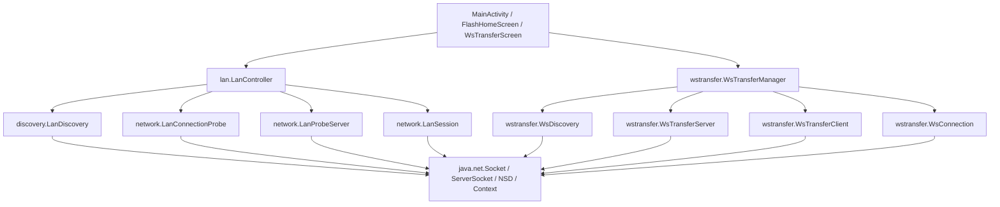

# Flash Architecture Audit

**Author:** Lead Android Software Architect & Migration Engineer  
**Date:** 2026-08-20  
**Baseline Build Status:** Verified Green (`testDebugUnitTest` 24/24 tasks up-to-date / passing)  
**Version Catalog / SDK:** AGP `9.3.1`, Kotlin `2.2.10`, Compile SDK `37`, Target SDK `36`, Min SDK `24`, Compose BOM `2025.12.00`

---

## 1. Executive Summary

Flash is evolving from an Android LAN/Wi-Fi transfer and chat prototype into a modular, local-first communication platform with headless networking engines, high-performance file transfer, and standalone Compose UI libraries.

This audit evaluates the codebase in its current state prior to executing the multi-module migration. The findings confirm that while Flash has established functional discovery, TCP sessions, RFC 6455 WebSocket transfers, and custom Compose UI components (UI-001 through UI-006, UI-037), **all code currently resides in a monolithic `:app` module with significant layer blurring, direct UI-to-network coupling, duplicated networking logic, and missing domain abstraction boundaries.**

---

## 2. Current Module Structure & Build Graph

```text
Flash (Root Project)
└── :app (Single Monolithic Android Application Module)
```

The application module `:app` currently contains all application code, presentation logic, custom Compose components, design tokens, icons, raw TCP/Socket sessions, NSD mDNS discovery listeners, RFC 6455 WebSocket codecs, and file streaming operations.

### Current Package Topology

```text
com.transfer.flash/
├── MainActivity.kt                      (App host, composition root, navigation, controller lifecycles)
├── discovery/
│   └── LanDiscovery.kt                  (NSD registration, discovery, resolve queue, multicast lock)
├── identity/
│   └── AppIdentity.kt                   (SharedPreferences UUID and device name storage)
├── lan/
│   └── LanController.kt                 (Orchestrates discovery, probe server, probe client, LanSession)
├── model/
│   └── DiscoveredDevice.kt              (DiscoveredDevice data model, TransportType enum)
├── network/
│   ├── LanConnectionProbe.kt            (Socket factory binding, TCP reachability probe, connectSession)
│   ├── LanProbeMessages.kt              (Line-based protocol encoding/decoding, string escaping)
│   ├── LanProbeServer.kt                (ServerSocket listener, inbound client handling, port fallback)
│   ├── LanSession.kt                    (Persistent socket wrapper, read loop, 3s heartbeat loop)
│   └── LocalNetworkAddresses.kt         (Wi-Fi / Ethernet / Hotspot IPv4 address enumerator)
├── ui/
│   ├── chat/                            (FlashChatList*, FlashChatHeader, FlashMessageBubble, FlashMessageList,
│   │                                     FlashComposer, FlashConversationScreen, FlashChatRepository)
│   ├── design/                          (Deprecated theme wrappers forwarding to ui.theme)
│   ├── icons/                           (FlashIcons registry, FlashIconSheet QA)
│   ├── theme/                           (FlashTheme, FlashColors, FlashTypography, FlashShapes, FlashSpacing,
│   │                                     FlashDimensions, FlashElevation, FlashMotion, FlashMotionSheet)
│   └── transfer/
│       └── WsTransferScreen.kt          (Experimental WebSocket transfer screen)
└── wstransfer/
    ├── WebSocketCodec.kt                (Pure Kotlin RFC 6455 frame codec, SHA-1 accept-key, Base64)
    ├── WsConnection.kt                  (Post-handshake WebSocket connection, frame IO loops)
    ├── WsDiscovery.kt                   (Separate NSD advertising and discovery for WS track)
    ├── WsPairingStore.kt                (SharedPreferences paired device persistence)
    ├── WsTransferClient.kt              (HTTP upgrade client with Network.socketFactory binding)
    ├── WsTransferManager.kt             (Multi-peer registry, SAF file sending, chunk reassembly)
    ├── WsTransferMessages.kt            (FLASH_WS_HELLO / FLASH_FILE_START/END/ACK protocol messages)
    └── WsTransferServer.kt              (HTTP upgrade server on port 45822 with dynamic fallback)
```

---

## 3. Current Dependency Direction & Layering Violations

### Observed In-Code Dependency Flow



### Identified Layer Violations & Coupling

1. **UI Directly Couples to Concrete Controllers and Managers:**
   - [`MainActivity.kt`](file:///E:/flash/app/src/main/java/com/transfer/flash/MainActivity.kt#L77-L89) instantiates `LanController(context)` and `WsTransferManager(context)` directly inside composables via `remember`.
   - UI views (`FlashHomeScreen`, `WsTransferScreen`) receive raw domain/network actions (`onProbeDevice`, `onManualConnect`, `onStartServer`, `onSendFile`) rather than interacting through abstract repositories.
2. **Domain Models Mixed with Presentation and Transport Types:**
   - [`FlashChatHeaderUiState`](file:///E:/flash/app/src/main/java/com/transfer/flash/ui/chat/FlashConversationModels.kt#L42-L53) embeds `FlashNetworkTransport` and `FlashPeerPresence` directly in the UI presentation model.
   - [`DiscoveredDevice`](file:///E:/flash/app/src/main/java/com/transfer/flash/model/DiscoveredDevice.kt#L8-L16) lives in a top-level `model` package and exposes raw host IP strings and port numbers directly to UI cards.
   - [`WsTransferUiState`](file:///E:/flash/app/src/main/java/com/transfer/flash/wstransfer/WsTransferManager.kt#L55-L70) exposes raw IP address lists, port strings, and connection internals to `WsTransferScreen`.
3. **Android Context Leaking into Core Logic:**
   - [`AppIdentity`](file:///E:/flash/app/src/main/java/com/transfer/flash/identity/AppIdentity.kt#L7-L13) requires `android.content.Context` to access `SharedPreferences`, preventing pure JVM unit testing of device identity.
   - [`LanConnectionProbe`](file:///E:/flash/app/src/main/java/com/transfer/flash/network/LanConnectionProbe.kt#L17-L24) and [`WsTransferClient`](file:///E:/flash/app/src/main/java/com/transfer/flash/wstransfer/WsTransferClient.kt#L19-L25) require `Context` for `ConnectivityManager` binding.
4. **Direct Socket and File I/O Management Inside Controllers:**
   - [`WsTransferManager.kt`](file:///E:/flash/app/src/main/java/com/transfer/flash/wstransfer/WsTransferManager.kt#L489-L504) contains the direct loop reading from `ContentResolver` and writing raw 64 KiB chunks to `WsConnection.sendBinary()`.
   - `WsTransferManager` also manages file creation (`uniqueReceivedFile`) and `BufferedOutputStream` writing inside the manager rather than delegating to an isolated transfer engine.
5. **UI Layer Contains Deprecated Compatibility Artifacts:**
   - `ui/design/` contains deprecated wrappers (`FlashChatTheme.kt`, `FlashColors.kt`, `FlashTokens.kt`, `FlashTypography.kt`) from the pre-UI-001 era that should be cleanly pruned during modularization.

---

## 4. Code Duplication & Technical Debt Audit

| Code Pattern / Feature | Instances in Codebase | Files Involved | Impact & Recommendation |
|---|---|---|---|
| **Protocol String Escaping** | Exact duplicate implementation of `%`, ` `, `=` encoding and decoding. | [`LanProbeMessages.kt`](file:///E:/flash/app/src/main/java/com/transfer/flash/network/LanProbeMessages.kt#L98-L110) & [`WsTransferMessages.kt`](file:///E:/flash/app/src/main/java/com/transfer/flash/wstransfer/WsTransferMessages.kt#L130-L143) | Extract single unified text framing and escape utility into `:core:common:protocol`. |
| **NSD Resolve Queue & Multicast Lock** | Duplicate `ArrayDeque<NsdServiceInfo>`, `resolveLock`, `queuedServiceNames`, generation tracking, and `WifiManager.MulticastLock`. | [`LanDiscovery.kt`](file:///E:/flash/app/src/main/java/com/transfer/flash/discovery/LanDiscovery.kt#L22-L58) & [`WsDiscovery.kt`](file:///E:/flash/app/src/main/java/com/transfer/flash/wstransfer/WsDiscovery.kt#L33-L69) | Consolidate into a reusable, hardened NSD resolver engine in `:core:discovery:nsd`. |
| **Network Interface & Socket Factory Selection** | Duplicate `findLanNetwork()` checking `TRANSPORT_WIFI` and `TRANSPORT_ETHERNET` via `ConnectivityManager.allNetworks`. | [`LanConnectionProbe.kt`](file:///E:/flash/app/src/main/java/com/transfer/flash/network/LanConnectionProbe.kt#L95-L101) & [`WsTransferClient.kt`](file:///E:/flash/app/src/main/java/com/transfer/flash/wstransfer/WsTransferClient.kt#L66-L72) | Consolidate into `NetworkInterfaceSelector` / `SocketFactoryProvider` in `:core:network:socket`. |
| **Local IPv4 Address Enumeration** | Extracted into `LocalNetworkAddresses`, but instantiated separately by multiple controllers. | [`LocalNetworkAddresses.kt`](file:///E:/flash/app/src/main/java/com/transfer/flash/network/LocalNetworkAddresses.kt) | Move to `:core:network:util` with clean interface abstraction. |
| **SharedPreferences Key Storage** | Ad-hoc SharedPreferences usage in identity and pairing. | [`AppIdentity.kt`](file:///E:/flash/app/src/main/java/com/transfer/flash/identity/AppIdentity.kt) & [`WsPairingStore.kt`](file:///E:/flash/app/src/main/java/com/transfer/flash/wstransfer/WsPairingStore.kt) | Standardize behind `FlashTrustStore` and `FlashIdentityStore` in `:core:security` and `:core:common`. |

---

## 5. Migration Risks & Mitigation Strategy

### Risk 1: Circular Module Dependencies
- **Description:** UI components may attempt to import transfer progress or connection states, while transfer engines might attempt to reference UI models.
- **Mitigation:** `:core:common` and `:core:messaging` must define pure domain contracts (`FlashDevice`, `FlashSession`, `FlashTransfer`, `FlashMessage`). `:ui:*` modules depend ONLY on `:ui:theme` and `:core:common` / `:core:messaging` / `:core:transfer` public APIs. `:core:*` modules will have zero dependencies on `:ui:*`.

### Risk 2: Broken State Synchronization Across Sessions
- **Description:** Moving `LanSession` and `WsTransferManager` behind `FlashNetwork` and `FlashTransferRepository` could break heartbeat-based disconnect detection or peer presence updates.
- **Mitigation:** Implement adapter wrappers that maintain existing StateFlow emission semantics while hiding raw socket objects behind `FlashSession` and `FlashTransfer` interfaces.

### Risk 3: Compose Runtime Leaking into Core Engines
- **Description:** Accidentally adding Compose dependencies or Compose `State<T>` to core libraries.
- **Mitigation:** Strict enforcement of Gradle build scripts: `:core:*` build files will NOT apply the `kotlin-compose` plugin and will not include `androidx.compose.*` dependencies. All reactive core APIs will use Kotlin Coroutines `StateFlow<T>` and `Flow<T>`.

### Risk 4: Test Regression During Package Relocation
- **Description:** Moving unit tests (`WebSocketCodecTest`, `WsTransferMessagesTest`, `LanProbeMessagesTest`, `FlashMessageGroupingTest`, `FlashMessageInsertionTest`) to new module directories could lead to lost test coverage or package visibility errors.
- **Mitigation:** Relocate tests concurrently with their respective source files and verify `./gradlew.bat testDebugUnitTest` passes after every single module extraction phase.

### Risk 5: Missing Version Control / Rollback Protection
- **Description:** As recorded in `logs/handoff.md`, `E:\Flash` is not a Git repository, meaning `git revert` is unavailable.
- **Mitigation:** Implement strict phase-by-phase execution with atomic, additive Gradle configuration steps and explicit file-level rollback paths documented in the migration plan.
