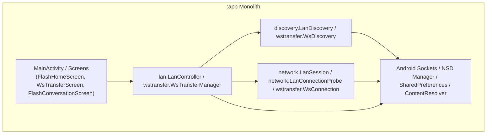
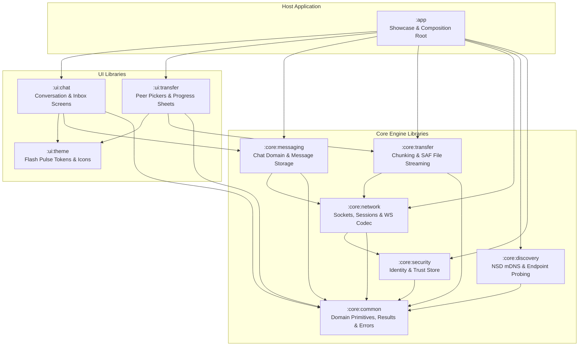

# Flash Library-First Architectural Migration Plan

**Document Version:** 1.0.0  
**Date:** 2026-08-20  
**Author:** Lead Android Software Architect & Migration Engineer  
**Status:** APPROVED FOR IMPLEMENTATION  
**Target Group ID:** `com.transfer.flash`  

---

## 1. Current Architecture

Flash is currently structured as a single monolithic Android application module (`:app`). While functional networking, session management, and custom Compose UI components exist, the architecture currently exhibits tight coupling between presentation and networking, duplicate protocol code, missing domain abstractions, and lack of standalone library packaging.

```text
Current State:
  :app (Monolith: UI + Presentation + Domain + Sockets + NSD + WS Codec + Streaming)
```

---

## 2. Current Dependency Graph



---

## 3. Current Source Mapping

All 60 Kotlin source files, 7 unit test classes, and 75+ XML resources currently reside under `app/src/main/java/com/transfer/flash/` and `app/src/main/res/`.

- **Networking & Sockets:** `discovery/`, `identity/`, `lan/`, `network/`, `wstransfer/`
- **Presentation & Compose UI:** `ui/chat/`, `ui/design/`, `ui/icons/`, `ui/theme/`, `ui/transfer/`
- **Application Composition:** `MainActivity.kt`

---

## 4. Target Architecture

The target architecture transforms Flash into a modular, multi-library platform with clean separation between headless core engines, reusable UI component libraries, and the host showcase application.



---

## 5. Public API Design

Public APIs expose **stable domain abstractions** rather than concrete network or socket classes:

| Domain Area | Public API Contract | Internal Implementation Hidden Behind Contract |
|---|---|---|
| **Discovery** | `FlashDiscovery`, `FlashDiscoveryState` | `LanNsdDiscoveryInternal`, `NsDResolverQueue`, `ManualEndpointProbe` |
| **Networking** | `FlashNetwork`, `FlashSession`, `FlashNetworkState` | `LanSessionImpl`, `TcpSocketManager`, `WsConnectionImpl`, `SocketFactoryProvider` |
| **Transfer** | `FlashTransferRepository`, `FlashTransfer` | `SafStreamReader`, `ChunkPipeline`, `InboundReassembler`, `ChecksumVerifier` |
| **Messaging** | `FlashChatRepository`, `FlashMessage`, `FlashConversation` | `InMemoryChatRepository`, `MessageGroupingEngine`, Room DAO |
| **Identity & Security** | `FlashIdentity`, `FlashIdentityStore`, `FlashTrustStore` | `AndroidPreferencesIdentityStore`, `AndroidPreferencesTrustStore` |
| **Theme & UI** | `FlashTheme`, `FlashColors`, `FlashShapes`, `FlashIcons` | Custom Canvas drawables, Bézier paths, internal motion transition specs |

---

## 6. Module Graph

```text
Flash/
├── core/
│   ├── common/      (pure JVM/Android library; zero dependencies on other modules)
│   ├── security/    (depends on :core:common)
│   ├── discovery/   (depends on :core:common)
│   ├── network/     (depends on :core:common, :core:security)
│   ├── transfer/    (depends on :core:common, :core:network)
│   └── messaging/   (depends on :core:common, :core:network)
├── ui/
│   ├── theme/       (Compose UI library; design tokens, vector icons, motion)
│   ├── chat/        (Compose UI library; depends on :ui:theme, :core:messaging, :core:common)
│   └── transfer/    (Compose UI library; depends on :ui:theme, :core:transfer, :core:common)
└── app/             (Android Application; depends on all :ui:* and :core:* modules)
```

---

## 7. Package Migration Map

| Source Package (`com.transfer.flash.*`) | Target Module | Target Package Namespace |
|---|---|---|
| `model.*` | `:core:common` | `com.transfer.flash.core.common.model` |
| `identity.*` | `:core:security` / `:core:common` | `com.transfer.flash.core.security.identity` |
| `discovery.*` | `:core:discovery` | `com.transfer.flash.core.discovery.nsd` |
| `network.*` (TCP, sockets, addresses) | `:core:network` | `com.transfer.flash.core.network.tcp` |
| `wstransfer.WebSocketCodec` | `:core:network` | `com.transfer.flash.core.network.ws` |
| `wstransfer.WsConnection` | `:core:network` | `com.transfer.flash.core.network.ws` |
| `wstransfer.WsTransferServer/Client` | `:core:network` | `com.transfer.flash.core.network.ws` |
| `wstransfer.WsTransferManager` (Engine parts) | `:core:transfer` | `com.transfer.flash.core.transfer.engine` |
| `ui.theme.*` | `:ui:theme` | `com.transfer.flash.ui.theme` |
| `ui.icons.*` | `:ui:theme` | `com.transfer.flash.ui.icons` |
| `ui.chat.*` (Models & Repo abstractions) | `:core:messaging` | `com.transfer.flash.core.messaging.model` |
| `ui.chat.*` (Composables) | `:ui:chat` | `com.transfer.flash.ui.chat` |
| `ui.transfer.*` | `:ui:transfer` | `com.transfer.flash.ui.transfer` |
| `MainActivity.kt` | `:app` | `com.transfer.flash` |

---

## 8. Class Migration Matrix

| Current Class | Current Module | Target Module | Target Visibility | Target Public Abstraction | Migration Action |
|---|---|---|---|---|---|
| `DiscoveredDevice` | `:app` | `:core:common` | `public` | `FlashDevice` | Convert to `FlashDevice` / keep adapter |
| `TransportType` | `:app` | `:core:common` | `public` | `FlashTransportType` | Move and extend |
| `AppIdentity` | `:app` | `:core:security` | `internal` | `FlashIdentity` / `FlashIdentityStore` | Extract interface; implement with Android prefs |
| `LanDiscovery` | `:app` | `:core:discovery` | `internal` | `FlashDiscovery` | Adapt behind `FlashDiscovery` interface |
| `LanProbeServer` | `:app` | `:core:network` | `internal` | None (Internal Server) | Move to `core:network:tcp` |
| `LanProbeMessages` | `:app` | `:core:common` / `:core:network` | `internal` | `FlashTextFraming` | Deduplicate string escaping; move to network |
| `LanConnectionProbe` | `:app` | `:core:network` | `internal` | None (Internal Socket Probe) | Move to `core:network:tcp` |
| `LanSession` | `:app` | `:core:network` | `internal` | `FlashSession` | Adapt behind `FlashSession` interface |
| `LocalNetworkAddresses` | `:app` | `:core:network` | `internal` | `FlashNetworkAddressProvider` | Move to `core:network:util` |
| `WebSocketCodec` | `:app` | `:core:network` | `internal` | None (Internal Codec) | Move to `core:network:ws` |
| `WsConnection` | `:app` | `:core:network` | `internal` | `FlashSession` | Adapt behind `FlashSession` interface |
| `WsTransferServer` | `:app` | `:core:network` | `internal` | None (Internal WS Server) | Move to `core:network:ws` |
| `WsTransferClient` | `:app` | `:core:network` | `internal` | None (Internal WS Client) | Move to `core:network:ws` |
| `WsPairingStore` | `:app` | `:core:security` | `internal` | `FlashTrustStore` | Extract interface; implement with Android prefs |
| `WsTransferManager` | `:app` | `:core:transfer` / `:core:network` | `internal` | `FlashTransferRepository` | Split transfer engine from network registry |
| `WsTransferMessages` | `:app` | `:core:transfer` | `internal` | None (Internal Framing) | Move to `core:transfer:protocol` |
| `FlashChatRepository` | `:app` | `:core:messaging` | `public` | `FlashChatRepository` | Move interface and sample repo to messaging |
| `FlashConversationModels` | `:app` | `:core:messaging` / `:ui:chat` | `public` | `FlashMessage`, `FlashConversation` | Split domain models from UI-only state |
| `FlashChatListModels` | `:app` | `:ui:chat` | `public` | UI presentation state | Move to `:ui:chat` |
| `FlashTheme`, `FlashColors`, `FlashTypography`, `FlashShapes`, `FlashSpacing`, `FlashDimensions`, `FlashElevation`, `FlashMotion` | `:app` | `:ui:theme` | `public` | Design System Tokens | Move to `:ui:theme` |
| `FlashIcons`, `FlashIconSheet` | `:app` | `:ui:theme` | `public` | Icon System | Move to `:ui:theme` |
| `FlashAvatar` | `:app` | `:ui:theme` | `public` | Atomic UI Primitive | Move to `:ui:theme:components` |
| `FlashChatList*` Composables | `:app` | `:ui:chat` | `public` | Standalone UI | Move to `:ui:chat` |
| `FlashConversation*` Composables | `:app` | `:ui:chat` | `public` | Standalone UI | Move to `:ui:chat` |
| `FlashMessageBubble*` | `:app` | `:ui:chat` | `public` | Standalone UI | Move to `:ui:chat` |
| `FlashMessageList*` | `:app` | `:ui:chat` | `public` | Standalone UI | Move to `:ui:chat` |
| `FlashComposer*` | `:app` | `:ui:chat` | `public` | Standalone UI | Move to `:ui:chat` |
| `WsTransferScreen` | `:app` | `:ui:transfer` | `public` | Standalone UI | Move to `:ui:transfer` |
| `MainActivity` | `:app` | `:app` | `public` | Host Composition Root | Retain in `:app` |

---

## 9. UI Migration Plan

All completed UI-001 through UI-006 and UI-037 components are preserved intact:
1. Move `ui/theme/` and `ui/icons/` plus all `res/drawable/flash_ic_*.xml` vector resources to `:ui:theme`.
2. Delete deprecated compatibility aliases in `ui/design/`.
3. Move `FlashAvatar` to `:ui:theme`.
4. Move `FlashChatListScreen`, `FlashChatHeader`, `FlashMessageBubble`, `FlashMessageList`, `FlashComposer`, and related composables to `:ui:chat`.
5. Connect `:ui:chat` to `:core:messaging:FlashChatRepository`.
6. Unit tests `FlashMessageGroupingTest` and `FlashMessageInsertionTest` move to `:ui:chat:src/test`.

---

## 10. LAN Migration Plan

1. Move `LanDiscovery`, `LanConnectionProbe`, `LanProbeServer`, `LanSession`, and `LocalNetworkAddresses` into `:core:discovery` and `:core:network`.
2. Implement `FlashDiscovery` backed by `LanDiscovery` (with serialized resolver queue and multicast lock preserved).
3. Implement `FlashSession` backed by `LanSession` (with 3-second heartbeat and socket lifecycle preserved).
4. Adapt `LanController` into a headless `FlashNetworkEngine` that orchestrates discovery and TCP session bindings.

---

## 11. WebSocket Side-Track Treatment

Per ADR-007:
1. `WebSocketCodec`, `WsConnection`, `WsTransferServer`, and `WsTransferClient` move into `:core:network` under package `com.transfer.flash.core.network.ws`.
2. `WsTransferManager` engine logic moves into `:core:transfer` under package `com.transfer.flash.core.transfer.engine`.
3. `WsTransferScreen` moves into `:ui:transfer`.
4. Unit tests `WebSocketCodecTest` and `WsTransferMessagesTest` move to `:core:network` and `:core:transfer` test directories.
5. The WebSocket track remains an experimental transport engine and does NOT alter the primary LAN TCP+TLS roadmap.

---

## 12. Future Wi-Fi Direct Strategy

1. When `WifiP2pManager` is introduced, implement `WifiDirectDiscoveryInternal` implementing `FlashDiscovery` in `:core:discovery`.
2. Implement `WifiDirectTransport` implementing `FlashTransport` in `:core:network`.
3. UI components (`:ui:chat`, `:ui:transfer`) will receive `FlashDevice` with `FlashTransportType.WIFI_DIRECT` without code changes.

---

## 13. Future Mesh Strategy

1. Domain models `FlashGroup` and `FlashParticipant` are logical communication concepts in `:core:messaging`, completely decoupled from radio topology.
2. Future mesh multi-hop routing will implement `FlashTransport` in `:core:network`, preserving identical `FlashSession` semantics for the upper layers.

---

## 14. Persistence Strategy

1. Identity and Trust Stores (`FlashIdentityStore`, `FlashTrustStore`) in `:core:security` use SharedPreferences on Android with clean repository interfaces for future EncryptedSharedPreferences / Room migration.
2. Message storage in `:core:messaging` defines `FlashMessageStore` (in-memory for MVP, Room ready for production).

---

## 15. Security Boundaries

1. Identity: `FlashDeviceId` abstracting unique device UUID / public key hash.
2. Pairing: `FlashTrustStore` tracking verified/paired devices.
3. Transport Security: `FlashSecureSession` interface prepared for future TLS / Noise protocol encryption without changing upper messaging layers.

---

## 16. Testing Strategy

| Module | Test Types & Coverage |
|---|---|
| **`:core:common`** | Domain model tests, Result monad tests, protocol string escaping round-trip tests |
| **`:core:discovery`** | Resolver queue synchronization tests, discovery state flow tests |
| **`:core:network`** | `WebSocketCodecTest` (10 RFC 6455 vectors), `LanProbeMessagesTest`, `WsTransferMessagesTest`, session heartbeat tests |
| **`:core:transfer`** | Chunking buffer tests, byte-count verification tests, checksum tests |
| **`:core:messaging`** | Message grouping tests (`FlashMessageGroupingTest`), message sorting and state tests |
| **`:ui:chat`** | Insertion animation choreography (`FlashMessageInsertionTest`), at-bottom detection tests |
| **`:app`** | Showcase integration tests, full build and package verification |

---

## 17. Gradle Build & Version Catalog Strategy

### `gradle/libs.versions.toml`
Add library plugin:
```toml
[plugins]
android-library = { id = "com.android.library", version.ref = "agp" }
```

### Module Build Script Convention
Standardized across all `:core:*` and `:ui:*` library modules:
- Apply `alias(libs.plugins.android.library)`
- Set `minSdk = 24`, `compileSdk = 37`, `JavaVersion.VERSION_11`
- Configure `consumerProguardFiles("consumer-rules.pro")`
- Apply `maven-publish` plugin

---

## 18. Publishing Strategy

Each library module will configure Maven publication under group `com.transfer.flash`:
- `:core:common` -> `com.transfer.flash:core-common:1.0.0`
- `:core:security` -> `com.transfer.flash:core-security:1.0.0`
- `:core:discovery` -> `com.transfer.flash:core-discovery:1.0.0`
- `:core:network` -> `com.transfer.flash:core-network:1.0.0`
- `:core:transfer` -> `com.transfer.flash:core-transfer:1.0.0`
- `:core:messaging` -> `com.transfer.flash:core-messaging:1.0.0`
- `:ui:theme` -> `com.transfer.flash:ui-theme:1.0.0`
- `:ui:chat` -> `com.transfer.flash:ui-chat:1.0.0`
- `:ui:transfer` -> `com.transfer.flash:ui-transfer:1.0.0`

---

## 19. API Stability & Versioning Strategy

- Follow Semantic Versioning (`MAJOR.MINOR.PATCH`).
- Mark provisional or evolving APIs with `@FlashExperimentalApi`.
- Mark inter-module internal wiring with `@FlashInternalApi`.
- Track public API modifications in `docs/architecture/api-changelog.md`.

---

## 20. Risk Register & Mitigations

| ID | Risk | Severity | Mitigation |
|---|---|---|---|
| **R-01** | Accidental UI/Compose dependency in `:core:*` | HIGH | Build scripts for `:core:*` omit Compose plugins and dependencies completely. |
| **R-02** | Cyclic module dependencies | HIGH | Strict topological ordering: Core Common -> Security -> Discovery -> Network -> Transfer/Messaging -> UI Theme -> UI Components -> App. |
| **R-03** | Broken unit tests during relocation | MEDIUM | Relocate unit tests concurrently with source files and execute `testDebugUnitTest` at each phase. |
| **R-04** | Loss of Git rollback capability | MEDIUM | Follow an atomic, additive phase checklist where new modules are created and verified before cleaning old packages. |

---

## 21. Rollback Plan

If any module extraction fails verification:
1. Revert changes to `settings.gradle.kts` and root `build.gradle.kts`.
2. Remove the newly extracted module directory from the filesystem.
3. Verify `:app` compiles and passes unit tests (`testDebugUnitTest assembleDebug`).
4. Document the specific failure in `logs/errors.md` before attempting a revised extraction.

---

## 22. Phase-by-Phase Implementation Checklist

- [x] **Phase A: Architectural Audit & Target Plan** (Completed: `audit.md`, `target-architecture.md`, `public-api.md`, `library-first-migration-plan.md`)
- [x] **Phase B: Gradle & Build Infrastructure Setup**
  - [x] Add `android-library` to `gradle/libs.versions.toml`
  - [x] Register `android-library` in root `build.gradle.kts`
  - [x] Update `settings.gradle.kts` with modular architecture support
- [x] **Phase C: Extract `:core:common`**
  - [x] Create `core/common/build.gradle.kts`
  - [x] Move `DiscoveredDevice`, `TransportType`, `FlashAnnotations`, Result monads, and string framing utilities
  - [x] Move/add common tests; verify `testDebugUnitTest`
- [x] **Phase D: Extract `:core:security`**
  - [x] Create `core/security/build.gradle.kts`
  - [x] Move `AppIdentity` and `WsPairingStore` behind `FlashIdentity` and `FlashTrustStore`
  - [x] Verify `testDebugUnitTest`
- [x] **Phase E: Extract `:core:discovery`**
  - [x] Create `core/discovery/build.gradle.kts`
  - [x] Move `LanDiscovery` and `WsDiscovery` behind `FlashDiscovery`
  - [x] Verify `testDebugUnitTest`
- [x] **Phase F: Extract `:core:network`**
  - [x] Create `core/network/build.gradle.kts`
  - [x] Move `LanSession`, `LanProbeServer`, `LanConnectionProbe`, `LocalNetworkAddresses`, `WebSocketCodec`, `WsConnection`, `WsTransferServer`, `WsTransferClient`
  - [x] Move `WebSocketCodecTest`, `LanProbeMessagesTest`
  - [x] Verify `testDebugUnitTest`
- [x] **Phase G: Extract `:core:transfer`**
  - [x] Create `core/transfer/build.gradle.kts`
  - [x] Move `WsTransferManager` engine logic and `WsTransferMessages`
  - [x] Move `WsTransferMessagesTest`
  - [x] Verify `testDebugUnitTest`
- [x] **Phase H: Extract `:core:messaging`**
  - [x] Create `core/messaging/build.gradle.kts`
  - [x] Move `FlashChatRepository`, `SampleFlashChatRepository`, and conversation domain models
  - [x] Move `FlashMessageGroupingTest`
  - [x] Verify `testDebugUnitTest`
- [x] **Phase I: Extract `:ui:theme`**
  - [x] Create `ui/theme/build.gradle.kts`
  - [x] Move `FlashTheme`, `FlashColors`, `FlashTypography`, `FlashShapes`, `FlashSpacing`, `FlashDimensions`, `FlashElevation`, `FlashMotion`, `FlashIcons`, `FlashAvatar`, drawables
  - [x] Delete deprecated `ui/design/`
  - [x] Verify `assembleDebug`
- [x] **Phase J: Extract `:ui:chat` and `:ui:transfer`**
  - [x] Create `ui/chat/build.gradle.kts` and `ui/transfer/build.gradle.kts`
  - [x] Move chat composables to `:ui:chat`; move `FlashMessageInsertionTest`
  - [x] Move `WsTransferScreen` to `:ui:transfer`
  - [x] Verify `testDebugUnitTest assembleDebug`
- [x] **Phase K: Rewire `:app` Showcase & Quality Gate**
  - [x] Update `:app/build.gradle.kts` to depend on all libraries
  - [x] Refactor `MainActivity.kt` to compose modules cleanly
  - [x] Full quality gate: `./gradlew.bat testDebugUnitTest assembleDebug`
- [x] **Phase L: Resume UI Roadmap**
  - [x] Update `logs/progress.md`, `logs/handoff.md`
  - [ ] Resume UI-011 Composer research in `docs/ui/composer.md`

---

## 23. Verification Gates for Every Phase

Every migration phase must satisfy all six quality gates before advancing to the next phase:

1. **Build Gate:** `./gradlew.bat assembleDebug` succeeds with zero errors.
2. **API Gate:** Zero implementation classes leaked into public API signatures.
3. **Dependency Gate:** Module dependencies strictly follow the unidirectional topology graph.
4. **Test Gate:** `./gradlew.bat testDebugUnitTest` executes and all unit tests pass.
5. **Behavior Gate:** Existing functionality (LAN probe, persistent session, WS transfer, Chat UI screens) remains 100% operational.
6. **Documentation Gate:** `logs/progress.md`, `logs/handoff.md`, and relevant architecture documents are updated.

---

## 24. Master Blueprint Alignment & Incorporation

This migration plan is directly derived from and fully incorporates the core requirements of the original project specification:
[`Project Goal and Blueprint/android-lan-wifi-direct-transfer-app-plan.md`](file:///E:/flash/Project%20Goal%20and%20Blueprint/android-lan-wifi-direct-transfer-app-plan.md)

### Key Blueprint Specifications Preserved

1. **Transport-Agnostic File Transfer Engine (§1, §4):** Discovery and network transport remain completely swappable without rewriting the chunking/transfer engine.
2. **Wi-Fi Direct P2P Roadmap (§6, §27):** `WifiP2pManager`, DNS-SD pre-association service discovery, `NEARBY_WIFI_DEVICES` permissions, and Location Mode checks reside cleanly in `:core:discovery` and `:core:network`.
3. **Pairing & Cryptographic Trust (§8, §9):** 6-digit visual verification code exchange (`482 917`) and app-scoped device identities are isolated in `:core:security`.
4. **Chunking & Resume Protocol (§10, §11, §12, §13):** 4 MB – 16 MB benchmark chunking, BLAKE3/SHA-256 integrity verification, and Room database resume state reside in `:core:transfer`.
5. **Background Foreground Service Handling (§2.5, §19):** Modern Android 14+ `dataSync` foreground service type, notification channel, and Android 15+ 6-hour quota / `Service.onTimeout()` lifecycle management are architected into `:core:transfer` and `:app`.
6. **Storage Access Framework (§2.6, §16, §17):** `ACTION_OPEN_DOCUMENT`, Photo Picker, and persisted URI permissions drive the file streaming pipeline in `:core:transfer`.

