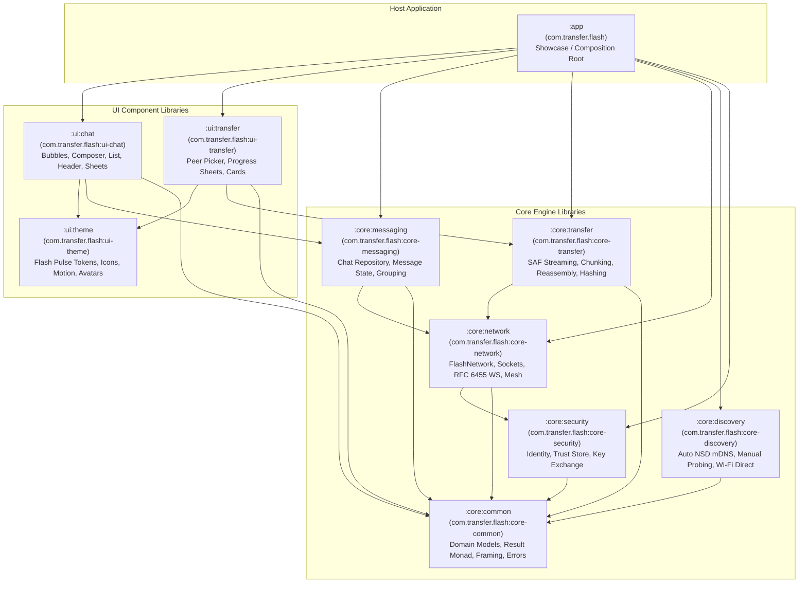

# Flash Target Architecture & Topology

**Author:** Lead Android Software Architect & Migration Engineer  
**Date:** 2026-08-20  
**Target Group ID:** `com.transfer.flash`  
**Status:** PROPOSED & ARCHITECTURALLY AUDITED

---

## 1. Architectural Philosophy & Core Invariants

Flash is transformed from a monolithic application into a **library-first platform**. The Flash Android app becomes a reference/showcase application built exclusively on top of Flash's own public library contracts.

```text
                         FLASH PLATFORM
                               │
              ┌────────────────┼─────────────────┐
              │                │                 │
         Core Network         Chat            Transfer
              │                │                 │
              └────────────────┼─────────────────┘
                               │
                         Flash SDK APIs
                               │
                     ┌─────────┴─────────┐
                     │                   │
              Flash Showcase App    Third-party apps
```

### Architectural Invariants

1. **Strict Headless Core:** `:core:*` modules have **zero** dependencies on Android UI, Jetpack Compose, or presentation components. They can run in background services, foreground services, WorkManager workers, test harnesses, or JVM/KMP CLI runtimes.
2. **Backend-Agnostic UI:** `:ui:chat` and `:ui:transfer` depend strictly on domain repositories (`FlashChatRepository`, `FlashTransferRepository`), never on low-level socket connections, NSD managers, or transport internals.
3. **Transport Independence:** Callers interact with `FlashNetwork` and `FlashSession`. The underlying transport (LAN TCP, Wi-Fi Direct, WebSockets, or future Mesh) is encapsulated behind `FlashTransport`.
4. **Stable Public Abstractions:** Public APIs expose stable domain models (`FlashDevice`, `FlashMessage`, `FlashTransfer`, `FlashGroup`, `FlashResult`). Internal implementations (`LanSessionImpl`, `NsdDiscoveryInternal`, `WebSocketCodec`, `WsConnection`) remain internal.
5. **Standalone Publishability:** Every library module can be built, tested, packaged as an independent AAR/JAR, and published to Maven repositories.
6. **No Runtime DI Framework Bloat:** Implementation wiring uses clean constructor injection and factory composition roots rather than forcing heavy DI runtimes on library consumers.

---

## 2. Target Module Topology & Dependency Graph



---

## 3. Module Registry & Responsibilities

| Module | Target Artifact | Package Namespace | Primary Responsibilities & Invariants |
|---|---|---|---|
| **`:core:common`** | `com.transfer.flash:core-common` | `com.transfer.flash.core.common` | • Pure domain models (`FlashDevice`, `FlashDeviceId`, `FlashTransportType`, `FlashPeerPresence`)<br/>• Common Result & Error hierarchy (`FlashResult<T>`, `FlashError`)<br/>• Protocol constants and text escape utilities (`FlashTextFraming`)<br/>• Stability annotations (`@FlashInternalApi`, `@FlashExperimentalApi`) |
| **`:core:security`** | `com.transfer.flash:core-security` | `com.transfer.flash.core.security` | • Device identity contracts (`FlashIdentity`, `FlashIdentityStore`)<br/>• Peer trust and pairing store (`FlashTrustStore`)<br/>• Future cryptographic session interfaces (`FlashSecureSession`, KeyExchange) |
| **`:core:discovery`** | `com.transfer.flash:core-discovery` | `com.transfer.flash.core.discovery` | • Public `FlashDiscovery` interface with `devices: Flow<List<FlashDevice>>`<br/>• Internal Android NSD/mDNS engine with serialized resolver queue and multicast lock<br/>• Manual endpoint reachability probe engine<br/>• Future Wi-Fi Direct peer scanner abstraction |
| **`:core:network`** | `com.transfer.flash:core-network` | `com.transfer.flash.core.network` | • Public `FlashNetwork` and `FlashSession` contracts<br/>• Transport management (`FlashTransport`, `LanTcpTransport`, `WsTransport`, future `WifiDirectTransport`)<br/>• Persistent socket session lifecycle, read loops, and heartbeat management<br/>• Hand-rolled RFC 6455 WebSocket client, server, and frame codec<br/>• Network interface routing & socket factory provider |
| **`:core:transfer`** | `com.transfer.flash:core-transfer` | `com.transfer.flash.core.transfer` | • Public `FlashTransferRepository` and `FlashTransfer` models<br/>• SAF (Storage Access Framework) streaming and binary chunking pipeline<br/>• Inbound chunk reassembly, byte-count verification, and SHA-256/BLAKE3 hashing<br/>• Transfer state machines (Offered, Transferring, Paused, Completed, Failed, Cancelled) |
| **`:core:messaging`** | `com.transfer.flash:core-messaging` | `com.transfer.flash.core.messaging` | • Public `FlashChatRepository` contract<br/>• Message domain models (`FlashMessage`, `FlashConversation`, `FlashGroup`, `FlashParticipant`, `FlashMessageStatus`)<br/>• In-memory and local database message persistence abstractions<br/>• Pure domain message grouping and layout calculations |
| **`:ui:theme`** | `com.transfer.flash:ui-theme` | `com.transfer.flash.ui.theme` | • **Flash Pulse Design System:** `FlashTheme`, `FlashColors`, `FlashTypography`, `FlashShapes`, `FlashSpacing`, `FlashDimensions`, `FlashElevation`<br/>• **Motion Design:** `FlashMotion` tokens, springs, transitions, reduce-motion probe<br/>• **Custom Icons:** `FlashIcons` registry + all vector drawables (`res/drawable/flash_ic_*`)<br/>• **Atomic UI Primitives:** `FlashAvatar`, `FlashSurface`, `FlashIcon` |
| **`:ui:chat`** | `com.transfer.flash:ui-chat` | `com.transfer.flash.ui.chat` | • Custom chat inbox screen (`FlashChatListScreen`, rows, top bar, unread badges)<br/>• Custom conversation screen (`FlashConversationScreen`, `FlashChatHeader`)<br/>• Custom message bubbles (`FlashMessageBubble`, concave pulse tail, adaptive width)<br/>• Message insertion choreography (`FlashMessageList`, `reverseLayout`, sibling glide)<br/>• Input composer (`FlashComposer`, adaptive multiline, action sheet, reactions) |
| **`:ui:transfer`** | `com.transfer.flash:ui-transfer` | `com.transfer.flash.ui.transfer` | • Discovered peer picker bottom sheets & nearby devices UI<br/>• Active transfer progress cards and bottom sheets<br/>• Diagnostic / standalone transfer screens (`FlashTransferScreen`) |
| **`:app`** | *(Application APK)* | `com.transfer.flash` | • Runnable showcase application & composition root<br/>• Wires core engines and repository implementations into UI screens<br/>• Android application lifecycle, permissions, and top-level navigation |

---

## 4. Multi-Transport Strategy & Future Readiness

The system decouples the user experience from the physical communication layer.

```text
FlashNetwork
     │
TransportManager
     │
 ┌───┼────────────────┬──────────────┐
 │   │                │              │
LAN  Wi-Fi Direct    WebSockets    Future Mesh/Relay
```

### Transport Isolation Principles

1. **Unified Session Interface (`FlashSession`):** Whether a peer is connected via a persistent LAN TCP socket, a Wi-Fi Direct socket, or an RFC 6455 WebSocket connection, the caller observes the exact same `FlashSession` methods (`send`, `disconnect`, `state`, `peer`).
2. **Experimental WebSocket Track:** Stays isolated inside `:core:network` (as `WsTransport` / `WebSocketCodec` / `WsConnection`) and `:core:transfer` (as `WsTransferEngine`). Third-party developers or the Flash showcase app can enable or disable WebSocket transport policies without altering UI or domain messaging code.
3. **Wi-Fi Direct Readiness:** When `WifiP2pManager` discovery and group negotiation are introduced, they implement `FlashDiscovery` and `FlashTransport` in `:core:discovery` and `:core:network` with **zero changes to `:ui:chat` or `:ui:transfer`**.
4. **Logical Groups vs Radio Groups:** A `FlashGroup` represents logical conversation participants (e.g. 5 members in a chat), regardless of whether the underlying radio topology is a Wi-Fi Direct Group Owner, a LAN star, or a multi-hop mesh.

---

## 5. Threading, Lifecycle & Error Architecture

### Threading Model
- **Non-blocking Reactive Flows:** Public API state is exposed via `StateFlow<T>` and `Flow<T>`.
- **Background Execution:** All I/O, socket reading/writing, hashing, and file streaming execute on `Dispatchers.IO`.
- **UI State Updates:** UI repositories emit updates that are collected on `Dispatchers.Main.immediate` or Compose lifecycle scopes (`collectAsStateWithLifecycle`).

### Error Hierarchy
Raw low-level exceptions (`SocketException`, `IOException`, `NsdManager` error codes) are never leaked across public API boundaries. They are mapped into domain-safe `FlashError` monads:

```kotlin
sealed interface FlashError {
    data class NetworkUnavailable(val message: String? = null) : FlashError
    data class PeerUnavailable(val deviceId: String, val message: String? = null) : FlashError
    data class ConnectionTimeout(val timeoutMs: Long) : FlashError
    data class ProtocolMismatch(val expected: Int, val actual: Int) : FlashError
    data class TransferFailed(val transferId: String, val reason: String) : FlashError
    data class VerificationFailed(val expectedHash: String, val actualHash: String) : FlashError
    data class StorageError(val message: String, val cause: Throwable? = null) : FlashError
    data class Cancelled(val reason: String? = null) : FlashError
}
```

---

## 6. Dependency Injection & Host Integration

Flash avoids heavy DI frameworks (Dagger, Hilt, Koin) in its core and UI libraries to maximize third-party embeddability, prevent transitive dependency conflicts, and maintain fast build times.

### Showcase App Composition Root Pattern

```kotlin
// App Composition Root in :app
class FlashPlatform(context: Context) {
    val identityStore: FlashIdentityStore = AndroidPreferencesIdentityStore(context)
    val trustStore: FlashTrustStore = AndroidPreferencesTrustStore(context)
    
    val discovery: FlashDiscovery = LanNsdDiscovery(context, identityStore)
    val network: FlashNetwork = FlashNetworkEngine(context, identityStore, trustStore)
    val transferRepository: FlashTransferRepository = FlashTransferEngine(context, network)
    val chatRepository: FlashChatRepository = FlashChatEngine(network)
}
```

---

## 7. Master Blueprint Incorporation & Cross-Reference

This target architecture directly incorporates and formalizes all specifications from the original project blueprint:
[`Project Goal and Blueprint/android-lan-wifi-direct-transfer-app-plan.md`](file:///E:/flash/Project%20Goal%20and%20Blueprint/android-lan-wifi-direct-transfer-app-plan.md)

### Blueprint Requirements Mapped to Modular Libraries

| Blueprint Specification Area | Blueprint Section | Target Module | Implementation Architecture |
|---|---|---|---|
| **Transport Abstraction** | Blueprint §4 | `:core:network` & `:core:discovery` | `FlashTransport` interface implemented by `LanTcpTransport`, `WsTransport`, and future `WifiDirectTransport`. |
| **Wi-Fi Direct P2P & Discovery** | Blueprint §6, §27 | `:core:discovery` & `:core:network` | `WifiP2pManager` DNS-SD pre-association service discovery and group negotiation with `NEARBY_WIFI_DEVICES` permissions encapsulated. |
| **Chunking Engine** | Blueprint §11 | `:core:transfer` | Binary chunk pipeline (4 MB – 16 MB baseline) with `file_id`, `chunk_index`, `offset`, `length`, and chunk checksums. |
| **Resume & Integrity Verification** | Blueprint §12, §13 | `:core:transfer` | Interrupted transfer state recovery with chunk-level tracking and BLAKE3 / SHA-256 cryptographic hashing. |
| **Pairing & Trust Architecture** | Blueprint §8, §9 | `:core:security` | 6-digit visual verification code exchange (`482 917`), app-scoped UUID identity, and persistent `FlashTrustStore`. |
| **Room Persistent State** | Blueprint §18 | `:core:transfer` & `:core:messaging` | Relational entities (`TransferEntity`, `FileTransferEntity`, `ChunkEntity`, `TrustedDeviceEntity`, `MessageEntity`). |
| **Background Transfers** | Blueprint §2.5, §19 | `:core:transfer` & `:app` | `dataSync` Foreground Service with Android 15 `Service.onTimeout()` handling and 6-hour daily quota management. |
| **Storage Access Framework** | Blueprint §2.6, §16, §17 | `:core:transfer` | `ACTION_OPEN_DOCUMENT`, Photo Picker integration, and persisted URI permissions for headless streaming. |
| **Automatic Transport Selection** | Blueprint §15, §28 | `:core:network` | Deterministic LAN priority with automatic Wi-Fi Direct fallback and throughput-based link ranking. |
